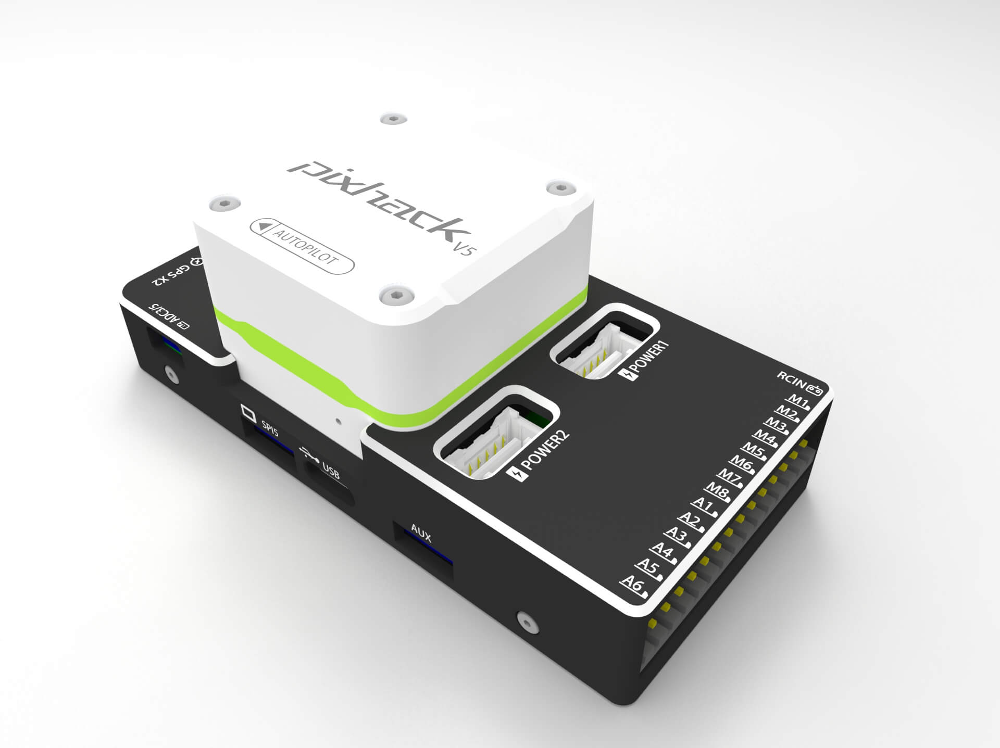

## Summary

---

### The new V5 CORE platform

PixHack V5 adopts the new V5 CORE platform; the core of the flight controller is integrated on the V5 core, and the bottom plate is detachable. It is only used as the external interface carrier to give consumers the space for customization. Users can design their own backplane according to their own needs.

### Faster processor

In the hardware configuration, pixhack v5 abandoned the px4 family's original STM32F427 processor and chose a more advanced STM32F765 processor, its frequency up to 216MHZ and contains 2MB FLASH/512K RAM, higher frequency, greater RAM, Speed will be greatly improved.

### More stable sensors

The PixHack V5 is similar to the pixhawk2.1 in terms of sensors. It also uses the third-degree redundant imu, but it chose a more stable ICM-20602/ICM-20689/BMI055/IST8310 sensor to improve its adaptability to different temperatures. .

### In addition, V5 also has the following advantages:

1, support RTK centimeter positioning;

2. Modular design facilitates integration;

3, built-in 3 sets of IMU redundancy;

4, rich I / O port;

5, metal housing built-in shock absorption;

6, support for many rich models.

## Hardware parameters {#硬件参数}

|  | **硬件参数** |
| :--- | :--- |
| 主处理器 | STM32F7653  \(32 Bit Arm® Cortex®-M7, 216MHz, 2MB flash, 512KB RAM\) |
| 协处理器 | STM32F100 \(32 Bit Arm® Cortex®-M3, 24MHz, 8KB SRAM\) |
| **传感器** |  |
| 加速器 | ICM-20602/ICM-20689/BMI055 |
| 陀螺仪 | ICM-20602/ICM-20689/BMI055 |
| 电子罗盘 | IST8310 |
| 气压计 | MS5611 |
| **接口** |  |
| UART串口 | 5 |
| 12c | 4 |
| PWM输出 | 标准8 PWM IO+6个可编程IO |
| 遥控器信号输入协议 | PPM/SBUS/DSM/DSM2 |
| RSSI输入 | PWM或3.3模拟电压 |
| CAN标准总线 | 2 |
| 电流电压输入 | 2 |
| 安全开关 | 1 |
| GPS接口 | 1 |
| Debug/F7 SWD接口 | 1 |
| USB接口 | 1\(Type-C\) |
| SPI接口 | 1 |
|  |  |
| **支持机型** |  |
| PX4固件 | 固定翼/3-8旋翼/直升机/VTOL垂直起降/无人机/无人船等 |
| **工作环境及物理参数** |  |
| PM工作电压 | 4.5 ~ 5.5 V |
| USB电压 | 5V +- 0.25v |
| 伺服输入 | 0-36v |
| 工作温度 | -40 ~ 85°c |
| **尺寸** |  |
| 长X宽X高 | 89\*42.5\*33mm |
| 重量 | 90g |

### 接口定义 {#接口定义}

> **Warning** RCIN接口只限于给遥控器供电，不可接入任何电源/负载.

### 固件编译命令 {#编译命令}

`make px4fmu-v5_default upload`

### 外围设备 {#外围设备}

* 空速计传感器
* 遥测无线电模块
* 测距仪/距离传感器 

