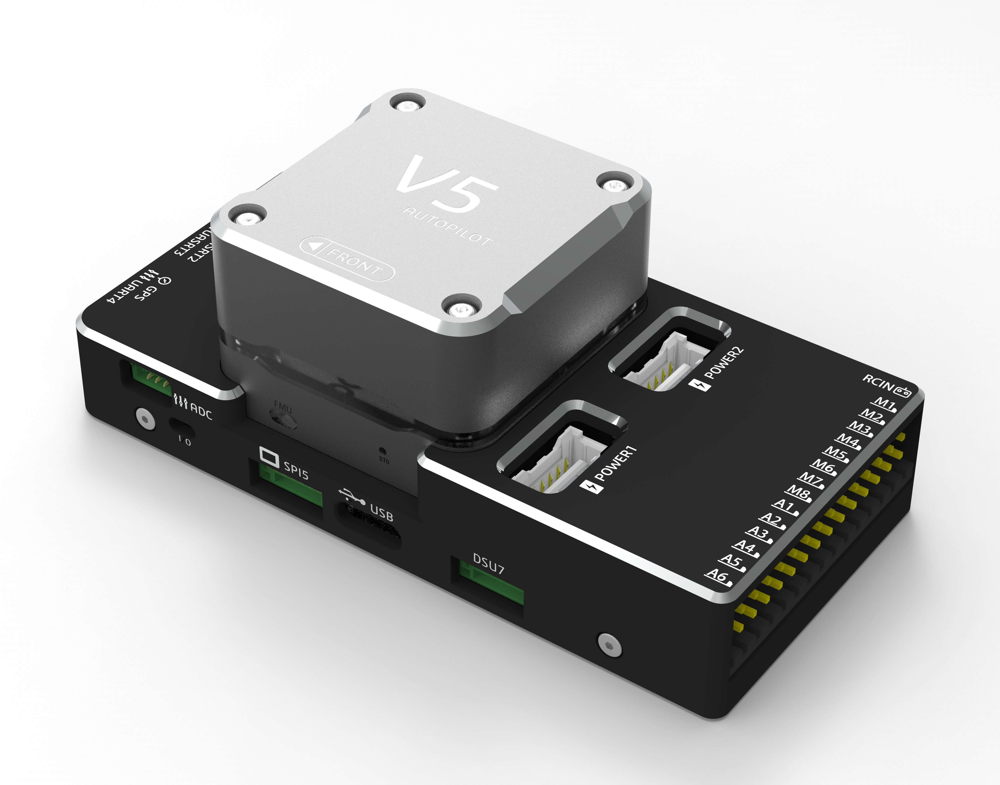

# 概述 {#概述}

---

V5系列自动驾驶仪是由CUAV独立设计，联合PX4与ArduPilot组织共同开发的无人系统自动驾驶仪。其包含V5、V5X、V5 NANO等.
其中：
**V5**:：基于FMUV5设计、沿用CUAV接口定义的全能型自动驾驶仪
**V5X**：基于FMUV5设计、Dronecode标准引脚定义的全能型自动驾驶仪
**V5 NANO**：针对传统直升机、微型无人机设计的微型自动驾驶仪.

