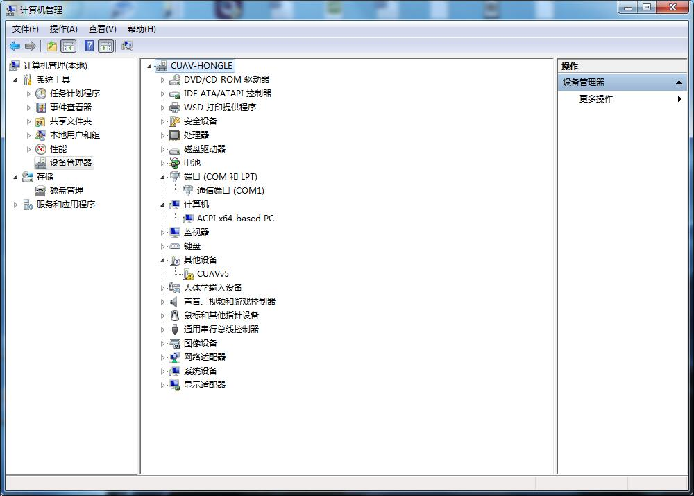
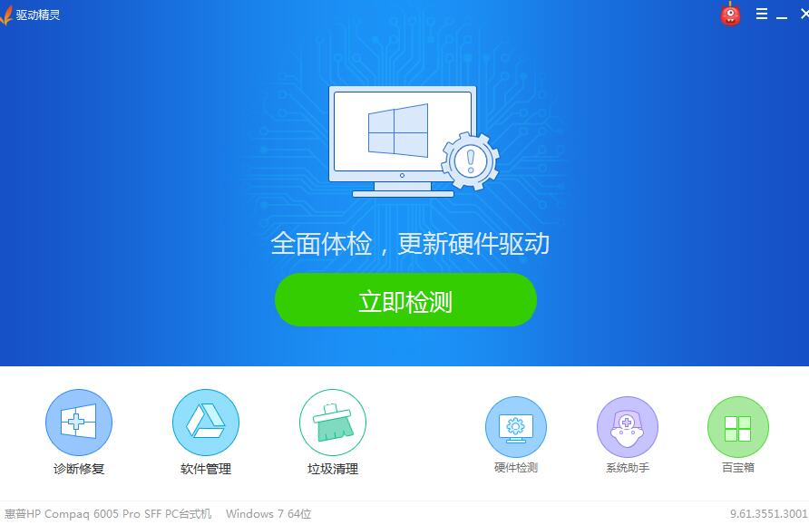
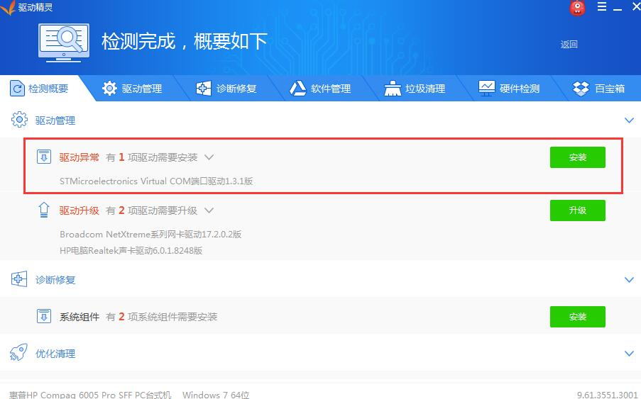

## 安装驱动程序

---

V5 AutoPilot windows的驱动程序由微软官方提供。在window10系统下系统自动安装驱动，在部分windows7/8系统中需要用户安装驱动,下面主要讲述如何手动安装驱动？

请先安装[驱动精灵](http://www.drivergenius.com/)并且将v5 AutoPilot通过usb线连接到电脑，打开驱动精灵，点击“立即检测”。

软件检测到设备驱动异常，点击右边安装按钮。

等待安装完成。

