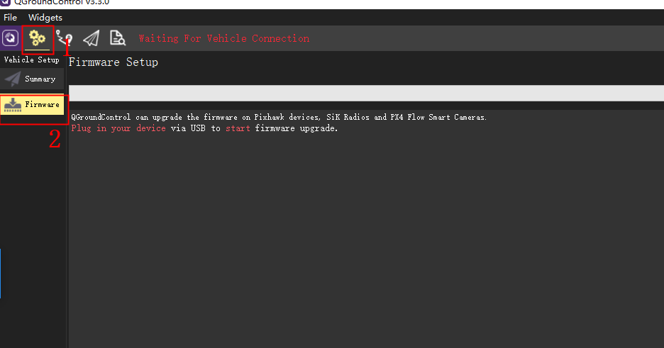
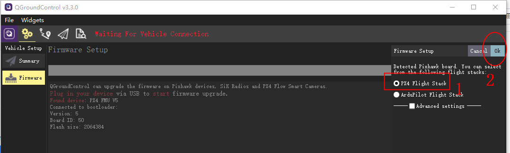
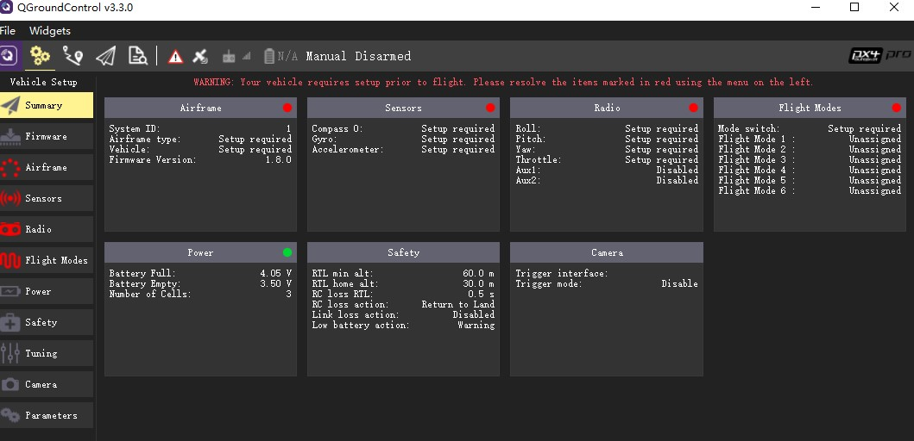
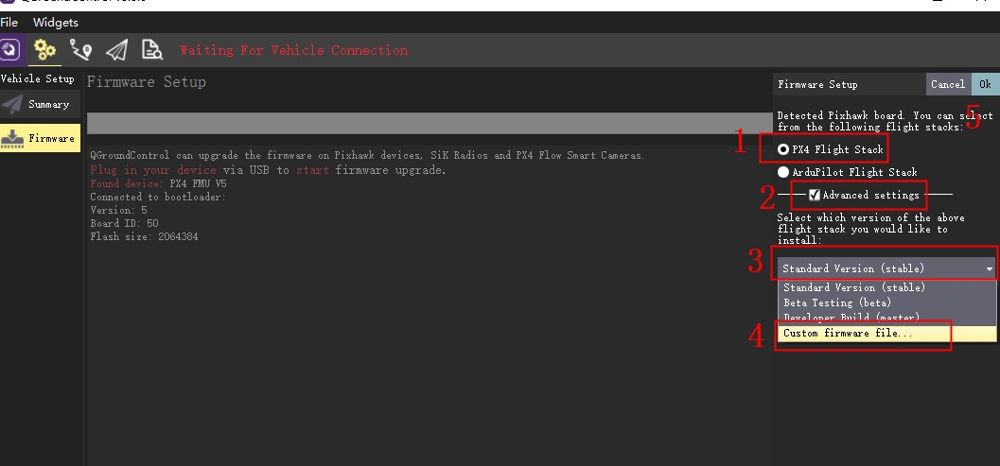

# 加载PX4原生固件

---

V5 AutoPilot支持PX4原生固件及ArduPilot,下面主要讲解如何加载这两种固件

### PX4原生固件

在V5 AutoPilot作为强大的飞行控制系统，当然少不了对PX4原生固件的兼容。在产品测试阶段，CUAV与DEV团队就达成了深入的合作意向，将就PX4原生固件与V5 AutoPilot的软硬件适配展开深度的合作与交流.通过不断的测试和修改，V5 AutoPilot专用的PX4原生固件已经发布了稳定版本（第一版为1.80 stable\).

##### 在线烧录：

PX4原生固件在线烧录固件需要先安装[QGoundcontrol](http://qgroundcontrol.com/)地面站,打开地面站》点击设置图标》点击firmware 将V5 AutoPilot通过usb线连接到电脑，地面站右边将弹出下图窗口》选择需要PX4 Flight STACK》OK加载完成，如不进行操作，十几秒后将自动连接。

---

##### 本地烧录：

请先下载[PX4原生固件](http://px4-travis.s3.amazonaws.com/Firmware/stable/px4fmu-v5_default.px4)至本地  
打开地面站》点击设置图标》点击firmware 将V5 AutoPilot通过usb线连接到电脑，地面站右边将弹出下图窗口》选择需要PX4 Flight STACK》勾选advanced settings&gt;custon firmware file》找到下载的固件》ok  
加载完成，如不进行操作，十几秒后将自动连接。

