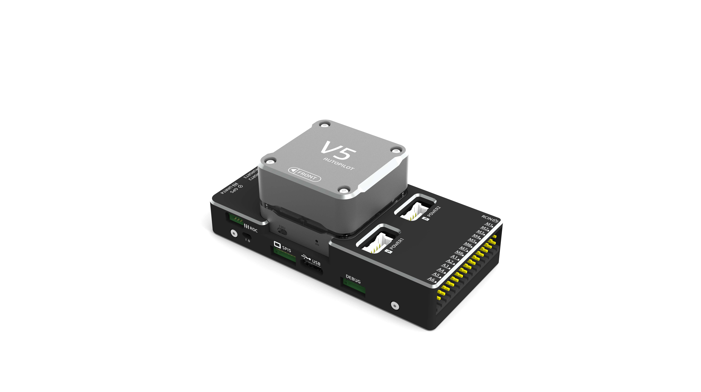

# 概述 {#概述}

---

### 小身材，大能量

为提高无人机内部空间的使用效率，V5—NANO采用了高度集成化设计，将主控尺寸缩减在xxmm，并且继承了V5自动驾驶仪的强大性能和丰富的扩展接口。

### 全新的开源硬件设计

V5 AutoPilot是CUAV基于[FMU V5](https://docs.px4.io/en/flight_controller/pixhawk_series.html)开源硬件全新打造的高性能飞行控制系统。[FMU v5](https://docs.px4.io/en/flight_controller/pixhawk_series.html)开源硬件的特点就是采用比FMU V3更加先进的处理器、更大的flash及RAM、更稳定可靠的传感器。

### 更快的处理器

在硬件配置上，V5 AutoPilot抛弃了px4家族原有的STM32F427处理器而选用了更为高级的STM32F765处理器，其主频高达216MHZ并且含有2MB FLASH/512K RAM，主频更高，RAM更大，速度将实现大幅度提升。

### 更稳定的传感器

传感器方面V5 AutoPilot与pixhawk3一样，同样采用三度冗余imu，但其选用了更为稳定的ICM-20602/ICM-20689/BMI055/IST8310等传感器，提高了其在不同温度下的适应能力。

### 除此之外，V5还具有以下优势：

1、支持RTK厘米定位；  
2、模块化设计方便集成；  
3、内置3组IMU冗余；  
4、丰富的I/O端口；  
5、金属外壳内置减震；  
6、支持众多丰富机型。

## 硬件参数 {#硬件参数}

|  | **硬件参数** |
| :--- | :--- |
| 主处理器 | STM32F765  \(32 Bit Arm® Cortex®-M7, 216MHz, 2MB flash, 512KB RAM\) |
| 协处理器 | STM32F100 \(32 Bit Arm® Cortex®-M3, 24MHz, 8KB SRAM\) |
| **传感器** |  |
| 加速计 | ICM-20602/ICM-20689/BMI055 |
| 陀螺仪 | ICM-20602/ICM-20689/BMI055 |
| 电子罗盘 | IST8310 |
| 气压计 | MS5611 |
| **接口** |  |
| UART串口 | 5 |
| I2C | 4 |
| PWM输出 | 标准8 PWM IO+6个可编程IO |
| 遥控器信号输入协议 | PPM/SBUS|
| RSSI输入 | PWM或3.3模拟电压 |
| CAN标准总线 | 2 |
| 电流电压输入 | 2 |
| 安全开关 | 1 |
| GPS接口 | 1 |
| Debug/F7 SWD接口 | 1 |
| USB接口 | 1\(Type-C\) |
| SPI接口 | 1 |
| **支持机型** |  |
| PX4固件 | 固定翼/3-8旋翼/直升机/VTOL垂直起降/无人车/无人船等 |
| **工作环境及物理参数** |  |
| PM工作电压 | 4.5 ~ 5.5 V |
| USB电压 | 5V +- 0.25v |
| 伺服输入 | 0-36v |
| 工作温度 | -40 ~ 85°c |
| **尺寸** |  |
| 长X宽X高 | 89\*42.5\*33mm |
| 重量 | 90g |

### 接口定义 {#接口定义}
> **NOTE** 如显示不清晰，请点击右键“另存为”下载到本地查看。

> **Comment** DUS 7为cuav全新命名的接口，其包含FMU SWD接口及UART7，其中当V5运行PX4固件时UART7作为DEBUG接口，当V5运行ArduPilot固件UART7作为通用串行口。RCIN接口只限于给遥控器供电，不可接入任何电源/负载.

### PX4固件编译命令 {#编译命令}

`make px4fmu-v5_default upload`

### ArduPilot固件编译命令 {#编译命令}

`./waf configure --board CUAVv5` 
 
`./waf copter --upload`

### 可选硬件设备 {#可选硬件}

* [空速计传感器](http://doc.cuav.net/tutorial/plane/optional-hardware/airspeed.html)
* [遥测无线电模块](http://doc.cuav.net/tutorial/plane/optional-hardware/radio.html)
* [测距仪/距离传感器 ](http://doc.cuav.net/tutorial/copter/optional-hardware/rangefinders/rangefinders.html)
* 更多可选硬件信息请访问[多旋翼可选硬件](http://preview.cuav.net/tutorial/copter/)/[固定翼可选硬件](http://preview.cuav.net/tutorial/plane/zh-hans/)界面
###视频介绍

https://www.youtube.com/watch?v=YeYq6qVBz4E

